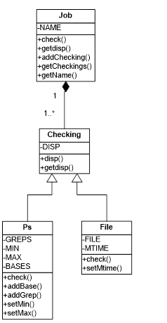

#shaker
**Programme de monitoring d'application Progress OpenEdge**

Surveillance basée sur :
* exécution du processus OpenEdge
* connexion au SGBD Progress OpenEdge
* absence de locks du SGBD
* écriture dans un fichier

Possibilité d'exécution simple ou en tâche de fond *(daemon)*, rapports par mails, configuration dans XML, multiples daemons possibles.

Développé en 2009 pour tourner sur du HP-UX, sur lequel la présence de Perl était une bénédiction.
Le système surveillé était une application de gestion de production industrielle, chez un des leaders mondiaux des arômes et parfums de synthèse.

---

Shaker (perl monitoring tool for MES interfaces) allows from a same tool to run
* one-shot checking: when checks are done, displays information and exits
* as a daemon, running in background and sending email when a error occurs

Perl language is used, with some Shell scripts or ProgressABL procedures. XML language is used for configuration files.

## How To
###1.1.	Create a one-shot checking configuration file
As all XML files, the first line must be
`	<?xml version="1.0"  encoding="UTF-8"?>`
The root element is 
`	<shaker>`
For one-shot checks, only verbose setting can be defined: with it, all collected information will be displayed, else only jobs with errors. To set it, the root element must be
`	<shaker verbose=”verbose”>`
You can define as many job elements as needed; see below how to define a job.
Finally the root element must be closed :
`	</shaker>`

###1.2.	Create a daemon configuration file
As all XML files, the first line must be
`	<?xml version="1.0"  encoding="UTF-8"?>`
In daemon mode, daemon and mailto attributes must be defined for the shaker root element; delay attribute should be defined, by default it will be 300 seconds (5 minutes):
* daemon must be defined as daemon
* mailto must contain email addresses to send email to, space separated.
* delay defines delay in seconds between two checks. It should not be lower than 60.	
`<shaker daemon=”daemon” mailto=”foo@mail.com  bar@mail.com” delay=”120”>`
You can define as many job elements as needed; see below how to define a job.
Finally the root element must be closed :
`	</shaker>`
Note that if a modification is made in a daemon configuration file, Shaker must be restarted.

###1.3.	Define a job
Each job to check has to be defined in a job element, with name attribute defined:
`	<job name=”example job”>`
job elements can include two verification : process-based ps, or file-based file.
ps element should have min or/and max attribute:
`	<ps min=”1”>`
ps element must have at least one grep element to allow script finding the process. These elements will be used to identify the process, and must be as accurate as possible. You can use the ps –ef unix command to find what can be used to find job’s process.
`	<grep>/mes/progress/prgs101c/bin/_progres -b -pf 			/mes/zzmes/prd/pf/ful.pf -p zzfoobar.p</grep>`
`	<grep>mmes_mgr</grep>`
ps element should also have base elements to check database connections and locks:
`	<base>/db/prd/guidb</base>`
`	<base>/db/prd/mesdb</base>`
`	<base>/db/prd/intdb</base>`
`	<base>/db/prd/msqdb</base>`
`	<base>/db/prd/trchst</base>`
`</ps>`
file element directly contain full path to file to check. mtime attribute can be used to define what is the maximum last write time, in seconds. If it is not defined, only file existence will be checked.
		`<file>/complete/path/to/file</file>`
		`<file mtime=”60”>/must/be/writed/in/the/last/minute</file>`
Don’t forget to close the job element:
	`</job>`

###1.4.	Launch Shaker
Main file is shaker.pl: you must launch it with configuration file as parameter:
`	./shaker.pl foo.xml`
or
`	/complete/path/to/shaker.pl bar.xml`
Configuration file must be present in Shaker’s directory, or in current directory.
Only one occurrence of shaker can be launched as daemon. When trying to start second occurrence, script will show what PID of running daemon is and exit.

###1.5.	Stop Shaker when running in daemon mode
stopshaker.sh shell script can be used to stop a daemon.

###1.6.	Find if a daemon is running and what configuration file is used for
Unix command ps –ef | grep perl will show if a daemon is running, with full path to shaker.pl and configuration file name.

##2.	Technical details
###2.1.	Configuration files XML structure
shaker root element
  daemon: optional; if “daemon” value, shaker runs as a daemon. mailto must be specified.
  delay: optional; delay between two checks if daemon mode, in seconds. 300 by default.
  mailto: required if daemon mode; email addresses to send email to.
  verbose: optional; if “verbose”, displays all information; else displays only jobs with errors.
  - job element
    name: required, the job name (should contain environment)
    - ps element
      min : Numeric, optional; Must find at least n processes
      max: Numeric, optional; Must find less than n processes
      - grep element: String, required: how to find process
      - base element: String, optional: which base job is connected to
    - file element
      mtime: Numeric, optional; max time elapsed since last write, in seconds. If time is exceeded, an error is send
        File’s absolute path

###2.2.	Files listing

File	Language	Description
shaker.pl	Perl	Main file ; executable
Loader.pm	Perl	Module: Configuration loading
Job.pm	Perl	Class: contains process and file based checkings
Checking.pm	Perl	Class: defines result output for Ps and File classes
Ps.pm	Perl	Class: process-based checking (includes bases connections and locks) , inherits from Checking
File.pm	Perl	Class: file-based checking, inherits from Checking
Function.pm	Perl	Module: miscellaneous functions
stopshaker.sh	Unix Shell	Stop running daemon ; executable
chk_locks.sh	Unix Shell	List locks for a base ; if a usernum is specified, list locks from user, and locks with a common RecID
locks.p	ProgressABL	Display locks for connected base
locksload.p	ProgressABL	List locks for connected base
convrxxid_x.p	ProgressABL	Convert a RowID to a RecID
shaker.dtd	DTD	Document Type Definition for XML configuration files

###2.3. Class diagram
